# Workflow de Développement et Déploiement - Tontine App Pro

---

## 📋 Table des matières

1. [Gestion de version (Semantic Versioning)](#gestion-de-version-semantic-versioning)
2. [CHANGELOG et Commits](#changelog-et-commits)
3. [Workflow de développement](#workflow-de-développement)
4. [Build et compilation](#build-et-compilation)
5. [Déploiement Google Play](#déploiement-google-play)
6. [Checklist de release](#checklist-de-release)

---

## 🏷️ Gestion de version (Semantic Versioning)

### **Format : `MAJOR.MINOR.PATCH`**

```
v0.4.0
│  │  │
│  │  └─ PATCH : Bug fixes (compatible backward)
│  └──── MINOR : Nouvelles fonctionnalités (compatible backward)
└─────── MAJOR : Breaking changes (incompatible)
```

### **Quand incrémenter chaque version**

| Type | Version | Exemple | Quand l'utiliser |
|------|---------|---------|------------------|
| **PATCH** | `0.4.0` → `0.4.1` | Correction de bugs critiques | - Fix d'un crash<br>- Correction UI mineure<br>- Performance improvement |
| **MINOR** | `0.4.0` → `0.5.0` | Nouvelles fonctionnalités | - Nouvelle page/feature<br>- Amélioration UX majeure<br>- Nouvelle intégration API |
| **MAJOR** | `0.4.0` → `1.0.0` | Breaking changes | - Refonte architecture<br>- Suppression feature existante<br>- Changement modèle de données |

### **Exemples concrets du projet**

```
v0.1.0  - Initial release (MVP)
v0.1.1  - Fix: Infinite loading on ProfilePage
v0.1.2  - Feat: GetX Bindings implementation
v0.2.0  - Feat: Order cancellation & item removal
v0.2.1  - Feat: Enhanced dialogs system
v0.3.0  - Feat: Wave-Orders linking
v0.4.0  - Feat: Wave-Products many-to-many + Product creation simplification
v1.0.0  - First stable release (production ready)
```

---

## 📝 CHANGELOG et Commits

### **Structure du CHANGELOG.md**

```markdown
## [0.4.0] - 2026-04-01

### Added
- **Feature Category**
  - Description détaillée de la feature
  - Impact utilisateur
  - Fichiers concernés

### Changed
- **Category**
  - Modification existante
  - Raison du changement

### Fixed
- **Bug Category**
  - Description du bug
  - Solution appliquée

### Technical Debt
- Dette technique adressée
- Refactoring effectué
```

### **Convention de Commits (Conventional Commits)**

```
<type>(<scope>): <description>

[optional body]

[optional footer]
```

#### **Types de commits**

| Type | Description | Exemple |
|------|-------------|---------|
| `feat` | Nouvelle fonctionnalité | `feat(wave): add product linking` |
| `fix` | Correction de bug | `fix(order): resolve total calculation` |
| `docs` | Documentation uniquement | `docs: update README installation` |
| `style` | Formatage, semi-colons, etc. | `style: format product controller` |
| `refactor` | Refactoring de code | `refactor(auth): simplify login flow` |
| `test` | Ajout/modification de tests | `test: add wave controller tests` |
| `chore` | Build, config, tooling | `chore: update dependencies` |
| `perf` | Performance | `perf: optimize product loading` |
| `ui` | UI/UX changes | `ui: improve button animations` |

#### **Exemples de messages de commit**

```bash
# ✅ Bon
feat(products): add wave-products many-to-many relationship
fix(auth): resolve infinite loading on profile page
docs: update CHANGELOG for v0.4.0
refactor(wave): simplify product loading logic
ui(wave): add loading spinner for better UX

# ❌ Mauvais
update code
fix bug
changes
wip
```

### **Workflow de commit**

```bash
# 1. Vérifier les changements
git status
git diff

# 2. Ajouter les fichiers
git add .

# 3. Commit avec message conventionnel
git commit -m "feat(wave): add product selection bottom sheet

- Create ProductSelectionSheet widget
- Add multi-select functionality
- Integrate with CreateWaveDialog
- Add real-time selection feedback"

# 4. Taguer la version (si release)
git tag -a v0.4.0 -m "Release version 0.4.0 - Wave Products Linking"

# 5. Push avec tags
git push origin main --tags
```

---

## 🔄 Workflow de développement

### **Branching Strategy (Git Flow simplifié)**

```
main (production)
  │
  ├─── develop (intégration)
  │      │
  │      ├─── feature/wave-products
  │      ├─── feature/order-tracking
  │      └─── fix/auth-loading
  │
  └─── hotfix/crash-fix (urgence production)
```

### **Cycle de développement typique**

```mermaid
graph LR
    A[Dev sur feature branch] --> B[Feature complète]
    B --> C[Tests & validation]
    C --> D[Merge sur develop]
    D --> E[Update CHANGELOG]
    E --> F[git commit + tag]
    F --> G[Build release]
    G --> H[Test interne]
    H --> I[Google Play Console]
    I --> J[Review Google]
    J --> K[Production]
```



### **Commandes quotidiennes**

```bash
# Démarrer une feature
git checkout develop
git pull origin develop
git checkout -b feature/nom-feature

# Travailler (commits réguliers)
git add .
git commit -m "feat(scope): description"

# Sync avec develop
git checkout develop
git pull origin develop
git checkout feature/nom-feature
git merge develop

# Terminer la feature
git checkout develop
git merge --no-ff feature/nom-feature
git push origin develop
git branch -d feature/nom-feature
```

---

## 🛠️ Build et compilation

### **Pré-requis**

```bash
# Vérifier l'environnement
flutter doctor -v

# Nettoyer le projet
flutter clean
flutter pub get

# Vérifier les erreurs
flutter analyze
```

### **Build Android (APK & AAB)**

```bash
# APK (pour test direct)
flutter build apk --release
# Output: build/app/outputs/flutter-apk/app-release.apk

# AAB (pour Google Play - REQUIS)
flutter build appbundle --release
# Output: build/app/outputs/bundle/release/app-release.aab

# Build avec versioning
flutter build appbundle --release \
  --build-name=1.0.0 \
  --build-number=1
```

### **Gestion du versioning (pubspec.yaml)**

```yaml
name: tontine_app_pro
description: Tontine management application
version: 0.4.0+4  # MAJOR.MINOR.PATCH+build_number

environment:
  sdk: ">=3.0.0 <4.0.0"
```

**Règles :**
- `version: 0.4.0` → Version visible par les utilisateurs
- `+4` → Build number (incrémenté à chaque build, invisible)
- Google Play requiert un build number unique à chaque upload

### **Script de build automatisé**

```bash
#!/bin/bash
# scripts/build_release.sh

VERSION=$1
BUILD_NUMBER=$2

if [ -z "$VERSION" ]; then
  echo "Usage: ./build_release.sh 0.4.0 4"
  exit 1
fi

echo "🔨 Building version $VERSION+$BUILD_NUMBER..."

# Update pubspec.yaml version
sed -i '' "s/version: .*/version: $VERSION+$BUILD_NUMBER/" pubspec.yaml

# Clean and build
flutter clean
flutter pub get
flutter analyze
flutter build appbundle --release

echo "✅ Build complete!"
echo "📦 AAB location: build/app/outputs/bundle/release/app-release.aab"
```

---

## 📤 Déploiement Google Play

### **Pré-requis Google Play Console**

1. ✅ Compte développeur Google Play ($25 one-time)
2. ✅ Application créée dans la console
3. ✅ Fichiers de configuration :
   - `google-services.json` (Android)
   - Keystore de signing

### **Configuration du signing (keystore)**

```bash
# 1. Créer un keystore (PREMIÈRE FOIS UNIQUEMENT)
keytool -genkey -v -keystore ~/tontine-app-key.jks -keyalg RSA -keysize 2048 -validity 10000 -alias tontine

# 2. Créer key.properties
echo "storePassword=<password>" >> android/key.properties
echo "keyPassword=<password>" >> android/key.properties
echo "keyAlias=tontine" >> android/key.properties
echo "storeFile=<path/to/tontine-app-key.jks>" >> android/key.properties

# 3. Configurer android/app/build.gradle.kts
val keystorePropertiesFile = rootProject.file("key.properties")
val keystoreProperties = Properties()
keystoreProperties.load(FileInputStream(keystorePropertiesFile))

android {
  signingConfigs {
    create("release") {
      keyAlias = keystoreProperties["keyAlias"] as String
      keyPassword = keystoreProperties["keyPassword"] as String
      storeFile = file(keystoreProperties["storeFile"] as String)
      storePassword = keystoreProperties["storePassword"] as String
    }
  }
  buildTypes {
    release {
      signingConfig = signingConfigs.getByName("release")
    }
  }
}
```

### **Étapes de déploiement**

#### **1. Test interne (recommandé avant production)**

```bash
# Build pour test interne
flutter build appbundle --release

# Upload dans Google Play Console
# → Google Play Console → Votre app → Test interne → Créer une release
# → Upload app-release.aab
# → Ajouter notes de version
# → Enregistrer → Examiner → Démarrer la diffusion
```

**Avantages :**
- ✅ Review rapide (quelques heures)
- ✅ Test avec l'équipe avant production
- ✅ Rollback facile si problème

#### **2. Production**

```bash
# Build pour production
flutter build appbundle --release \
  --build-name=1.0.0 \
  --build-number=10

# Upload dans Google Play Console
# → Google Play Console → Votre app → Production → Créer une release
# → Upload app-release.aab
# → Remplir la fiche (notes, screenshots)
# → Soumettre pour examen
```

**Timeline Google :**
- ⏱️ **Test interne** : 2-24 heures
- ⏱️ **Production** : 1-7 jours (première release)
- ⏱️ **Mises à jour** : 1-3 jours

### **Notes de version (Release Notes)**

```markdown
## Version 0.4.0

### Nouvelles fonctionnalités
- ✨ Liaison produits-vagues (many-to-many)
- 🎯 Sélection multiple de produits via BottomSheet
- 📊 Section produits dans Wave Details

### Améliorations
- 🚀 Simplification création de produits
- 💫 Meilleure UX avec spinners de chargement
- 🎨 UI plus cohérente

### Corrections
- 🐛 Toutes les vagues affichaient les mêmes produits
- 🐛 Produits ne se chargeaient pas dans Wave Details
- 🐛 BottomSheet ne se fermait pas après validation
```

---

## ✅ Checklist de release

### **Avant commit final**

```
☐ Tests manuels effectués sur toutes les features
☐ Aucun crash ou bug bloquant
☐ Flutter analyze sans erreurs
☐ CHANGELOG.md mis à jour
☐ pubspec.yaml version incrémentée
☐ README.md à jour (si besoin)
☐ Documentation technique à jour (si besoin)
```

### **Commit et tag**

```bash
☐ git add .
☐ git commit -m "feat: description"
☐ git tag -a v0.4.0 -m "Release v0.4.0"
☐ git push origin main --tags
```

### **Build**

```bash
☐ flutter clean
☐ flutter pub get
☐ flutter analyze
☐ flutter build appbundle --release
☐ Vérifier taille AAB (< 150 MB)
☐ Tester APK localement
```

### **Google Play Console**

```bash
☐ Upload AAB dans Test Interne
☐ Tester sur appareil physique
☐ Valider avec l'équipe
☐ Promouvoir en Production
☐ Remplir notes de version
☐ Soumettre pour examen
```

### **Post-release**

```bash
☐ Surveiller crash reports (Play Console)
☐ Répondre aux avis utilisateurs
☐ Mettre à jour documentation
☐ Préparer prochaine version
```

---

## 📊 Tableau de suivi des versions

| Version | Date | Type | Features principales | Build Number |
|---------|------|------|---------------------|--------------|
| v0.1.0 | 2025-12-22 | MAJOR | MVP, Auth, CRUD | 1 |
| v0.1.1 | 2025-12-22 | PATCH | Fix INSTALL_FAILED | 2 |
| v0.1.2 | 2025-12-23 | MINOR | GetX Bindings | 3 |
| v0.2.0 | 2025-12-27 | MINOR | Order management | 4 |
| v0.2.1 | 2025-12-28 | PATCH | Dialogs system | 5 |
| v0.3.0 | 2026-04-01 | MINOR | Wave-Orders linking | 6 |
| v0.4.0 | 2026-04-01 | MINOR | Wave-Products linking | 7 |
| v1.0.0 | TBD | MAJOR | Production ready | 10 |

---

## 🚨 Gestion des urgences (Hotfix)

### **Quand utiliser un hotfix**

- 🚨 Crash en production
- 🚨 Bug bloquant pour les utilisateurs
- 🚨 Problème de sécurité

### **Workflow hotfix**

```bash
# 1. Créer branche hotfix depuis main
git checkout main
git pull origin main
git checkout -b hotfix/crash-fix

# 2. Corriger le bug
# ... code changes ...

# 3. Commit et tag
git commit -m "fix: resolve critical crash on wave details"
git tag -a v0.4.1 -m "Hotfix v0.4.1 - Critical crash fix"

# 4. Merge sur main et develop
git checkout main
git merge hotfix/crash-fix
git checkout develop
git merge hotfix/crash-fix

# 5. Push et build
git push origin main develop --tags
flutter build appbundle --release
```

---

## 📚 Ressources utiles

- [Semantic Versioning](https://semver.org/)
- [Conventional Commits](https://www.conventionalcommits.org/)
- [Flutter Build & Release](https://docs.flutter.dev/deployment/android)
- [Google Play Console](https://play.google.com/console)
- [Android App Bundles](https://developer.android.com/guide/app-bundle)

---

**Dernière mise à jour :** 2026-04-01  
**Version du document :** 1.0
